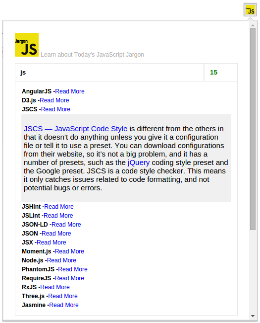

## JSJargon
An elegant chrome extension to learn about JavaScript jargon(inspired by [SJSJ](https://github.com/HugoGiraudel/SJSJ)).

## Screenshot

## How to install it ?
Well, at this moment it is not available at chrome webstore due to some problems with my chrome developer account.
Fortunatuly you can install it manually, just follow the following simple steps :

* Download the [zip file](https://github.com/ismnoiet/JSJargon/archive/v1.0.0.zip) and extract it wherever you want.
* Open a new chrome web page and go to
[chrome://extensions](chrome://extensions).
* Check the ``developer mode`` checkbox on the top right.
* Click on the ``load unpacked extension`` button and specify the path to the extracted zip file.
* That's it you're done, JUST don't forget to give us a star if you find it a good idea.

## How it works ?

**If** we click on an already selected item, the item definition
will be hided,
So we get back the nice default list of items without any definition enabled.
 **otherwise** the enabled definition will be removed and
 the definition of the current item will be shown in the
 appropriate place.

This extension also is markdown-based meaning that it reads markdown files, interpret and render them.

## Features

* Fuzzy search( you don't have to type the entire word).
* markdown support( all definitions are markdown text translated and rendered).

## Used libraries:

A big thank you for the open source community and especially the people working on the following libraries
* **Jquery** [url](https://code.jquery.com/jquery-2.1.4.min.js).
* **Markdown-js** [url](https://github.com/evilstreak/markdown-js).
* **Fuzzy**  [url](https://github.com/mattyork/fuzzy).

## Contribution
If you want to contribute, improve or suggest any idea,
you are more than welcomed just open an issue and i'll be more than happy to interact with you as soon as i'm available.

## TODO
* Replace the default scrollbar with a nice one.
* Create firefox alternative.
* Any feature you want to see :).
